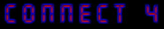



## A Connect 4 Game

### Description

Just click on the button above the column and a counter drops down that row. (It needs some AI to play against the PC.)
 
### More Info
 

             |
---                |---
**Submitted On**   |2000-04-23 22:50:00
**By**             |[Peter](https://github.com/Planet-Source-Code/PSCIndex/blob/master/ByAuthor/peter.md)
**Level**          |Intermediate
**User Rating**    |5.0 (20 globes from 4 users)
**Compatibility**  |VB 5\.0, VB 6\.0
**Category**       |[Games](https://github.com/Planet-Source-Code/PSCIndex/blob/master/ByCategory/games__1-38.md)
**World**          |[Visual Basic](https://github.com/Planet-Source-Code/PSCIndex/blob/master/ByWorld/visual-basic.md)
**Archive File**   |[CODE\_UPLOAD51274232000\.zip](https://github.com/Planet-Source-Code/peter-a-connect-4-game__1-7528/archive/master.zip)

